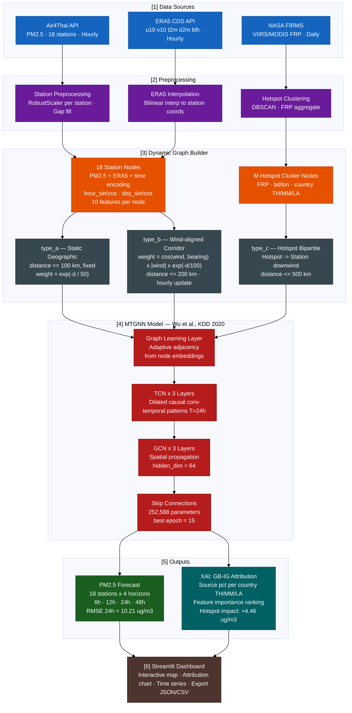

# Architecture Diagram — Mermaid Code

วาง code ด้านล่างที่ https://mermaid.live แล้วกด "Render"

```mermaid
%%{init: {"theme": "base", "themeVariables": {"background": "#ffffff", "primaryBackground": "#ffffff", "edgeLabelBackground": "#ffffff", "tertiaryBackground": "#ffffff"}}}%%
flowchart TD
    %% ── DATA SOURCES ──────────────────────────────────────────
    subgraph SRC["[1] Data Sources"]
        direction LR
        A4T["Air4Thai API\nPM2.5 · 18 stations · Hourly"]
        FRM["NASA FIRMS\nVIIRS/MODIS FRP · Daily"]
        ER5["ERA5 CDS API\nu10 v10 t2m d2m blh · Hourly"]
    end

    %% ── PREPROCESSING ─────────────────────────────────────────
    subgraph PRE["[2] Preprocessing"]
        direction LR
        PP1["Station Preprocessing\nRobustScaler per station · Gap fill"]
        PP2["Hotspot Clustering\nDBSCAN · FRP aggregate"]
        PP3["ERA5 Interpolation\nBilinear interp to station coords"]
    end

    %% ── GRAPH BUILDER ─────────────────────────────────────────
    subgraph GRB["[3] Dynamic Graph Builder"]
        direction TB
        SN["18 Station Nodes\nPM2.5 + ERA5 + time encoding\nhour_sin/cos · doy_sin/cos\n10 features per node"]
        HN["M Hotspot Cluster Nodes\nFRP · lat/lon · country TH/MM/LA"]

        EA["type_a — Static Geographic\ndistance <= 100 km, fixed\nweight = exp(-d / 50)"]
        EB["type_b — Wind-aligned Corridor\nweight = cos(wind, bearing) x |wind| x exp(-d/100)\ndistance <= 200 km · hourly update"]
        EC["type_c — Hotspot Bipartite\nHotspot -> Station downwind\ndistance <= 500 km"]
    end

    %% ── MTGNN MODEL ────────────────────────────────────────────
    subgraph MDL["[4] MTGNN Model — Wu et al., KDD 2020"]
        direction LR
        GL["Graph Learning Layer\nAdaptive adjacency\nfrom node embeddings"]
        TC["TCN x 3 Layers\nDilated causal conv\ntemporal patterns T=24h"]
        GC["GCN x 3 Layers\nSpatial propagation\nhidden_dim = 64"]
        SK["Skip Connections\n252,588 parameters\nbest epoch = 15"]
    end

    %% ── OUTPUTS ───────────────────────────────────────────────
    subgraph OUT["[5] Outputs"]
        direction LR
        FC["PM2.5 Forecast\n18 stations x 4 horizons\n6h · 12h · 24h · 48h\nRMSE 24h = 10.21 ug/m3"]
        XA["XAI: GB-IG Attribution\nSource pct per country TH/MM/LA\nFeature importance ranking\nHotspot impact: +4.46 ug/m3"]
    end

    %% ── DASHBOARD ─────────────────────────────────────────────
    DASH["[6] Streamlit Dashboard\nInteractive map · Attribution chart · Time series · Export JSON/CSV"]

    %% ── EDGES ─────────────────────────────────────────────────
    A4T --> PP1
    FRM --> PP2
    ER5 --> PP3

    PP1 --> SN
    PP2 --> HN
    PP3 --> SN

    SN --> EA
    SN --> EB
    HN --> EC

    EA --> GL
    EB --> GL
    EC --> GL

    GL --> TC
    TC --> GC
    GC --> SK

    SK --> FC
    SK --> XA

    FC --> DASH
    XA --> DASH

    %% ── STYLES ────────────────────────────────────────────────
    classDef srcStyle   fill:#1565C0,color:#fff,stroke:#0D47A1
    classDef preStyle   fill:#6A1B9A,color:#fff,stroke:#4A148C
    classDef nodeStyle  fill:#E65100,color:#fff,stroke:#BF360C
    classDef edgeStyle  fill:#37474F,color:#fff,stroke:#263238
    classDef modelStyle fill:#B71C1C,color:#fff,stroke:#7F0000
    classDef outStyle   fill:#1B5E20,color:#fff,stroke:#1B5E20
    classDef xaiStyle   fill:#006064,color:#fff,stroke:#006064
    classDef dashStyle  fill:#4E342E,color:#fff,stroke:#3E2723

    class A4T,FRM,ER5 srcStyle
    class PP1,PP2,PP3 preStyle
    class SN,HN nodeStyle
    class EA,EB,EC edgeStyle
    class GL,TC,GC,SK modelStyle
    class FC outStyle
    class XA xaiStyle
    class DASH dashStyle
```
