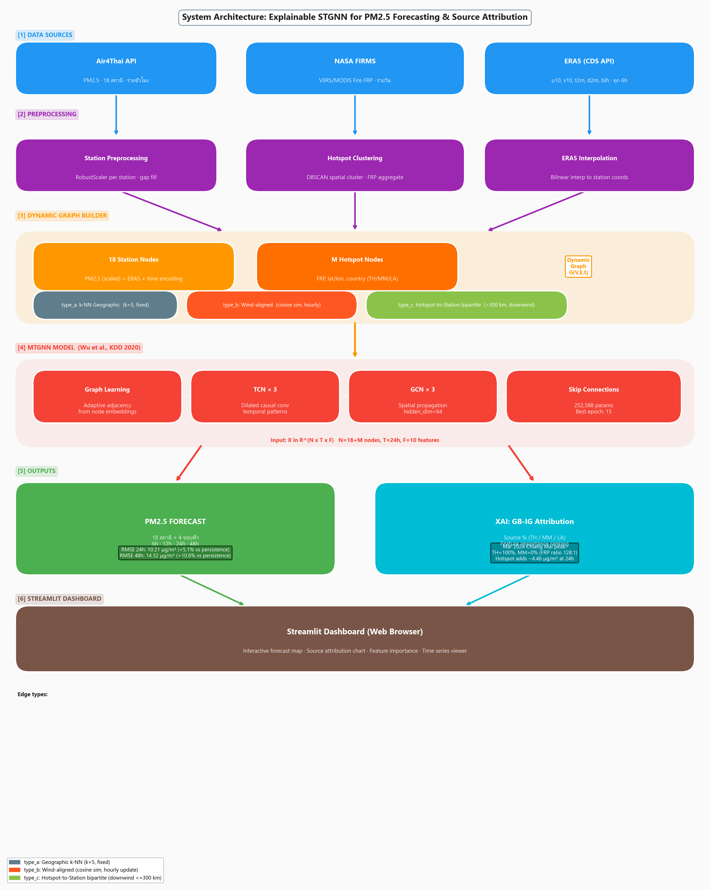
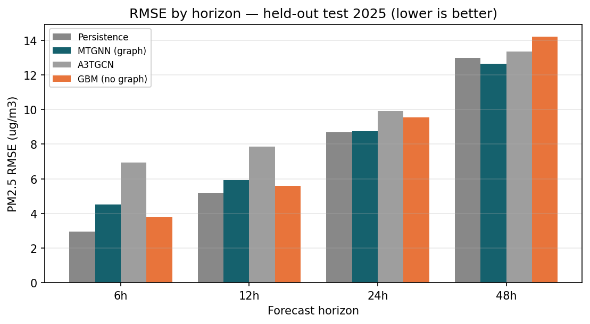
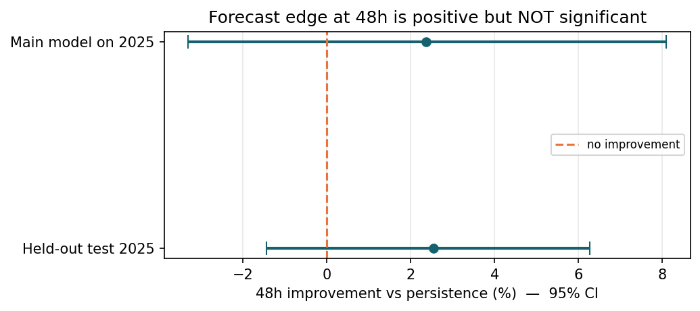
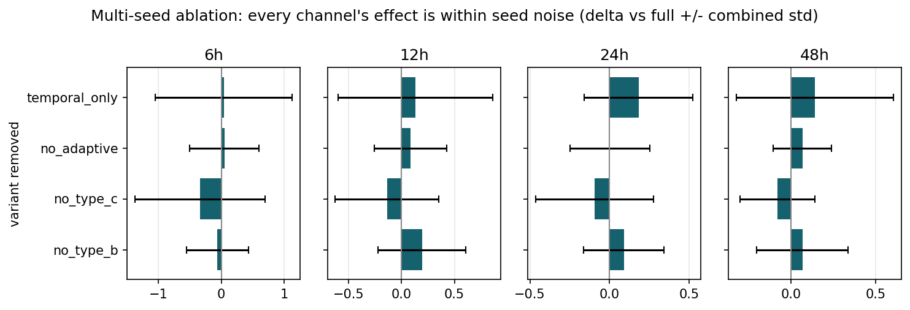
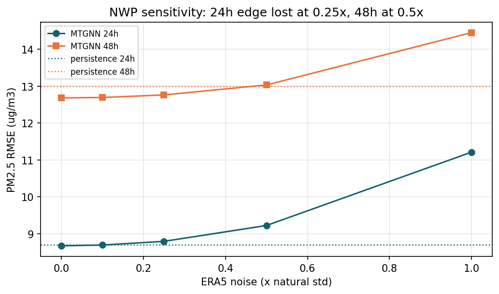
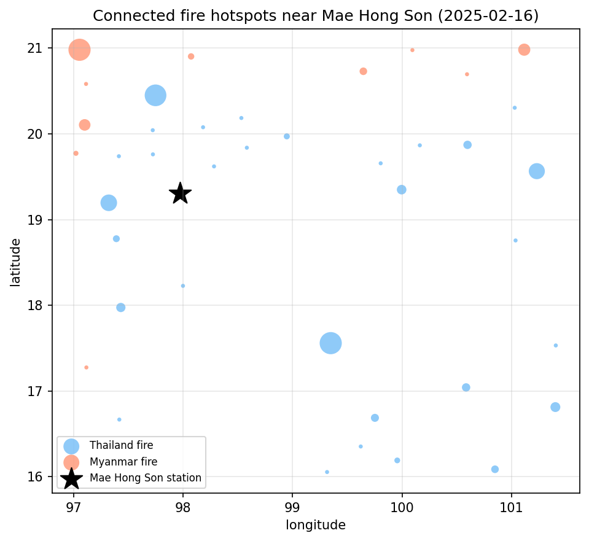
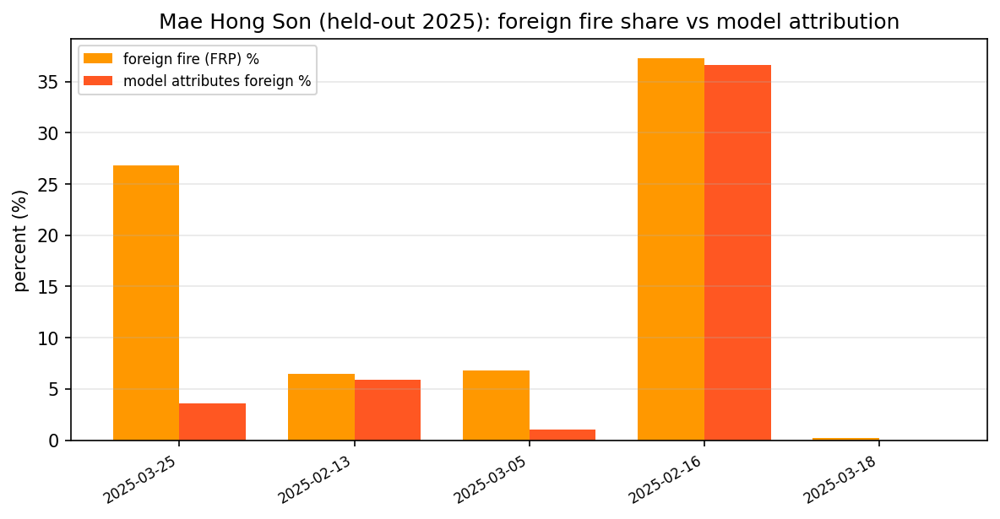
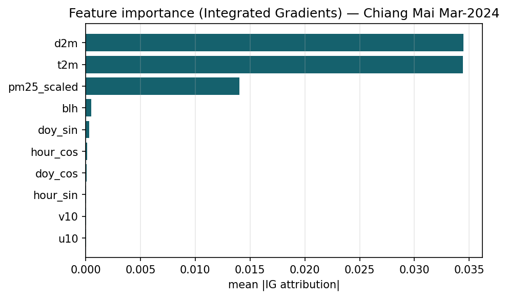

<!-- NSC 2026 Category 14 — Final Report DRAFT (Markdown source; Word generation is a later task).
     Numbers are the verified SESSION8/JSON values; the pre-Session-8 proposal numbers
     (10.21 / 14.32 / +5.1% / +10.6%) are SUPERSEDED and must never reappear. -->

# รายงานฉบับสมบูรณ์

**รหัสโครงการ:** 28P14E01196

**ชื่อโครงการ (ไทย):** ระบบพยากรณ์ฝุ่นละออง PM2.5 และวิเคราะห์แหล่งกำเนิดด้วยโครงข่ายกราฟประสาทเทียมเชิงปริภูมิ-เวลาแบบอธิบายได้ สำหรับภาคเหนือของประเทศไทย

**Project Title (English):** Explainable Spatio-Temporal Graph Neural Network for PM2.5 Forecasting and Source Attribution in Northern Thailand

**หมวดโปรแกรม:** หมวด 14 — โปรแกรมเพื่องานการพัฒนาด้านวิทยาศาสตร์และเทคโนโลยี (ระดับนิสิต นักศึกษา)

**ผู้พัฒนา:** นายรณชัย ขาวสะอาด — มหาวิทยาลัยบูรพา วิทยาเขตบางแสน คณะวิทยาการสารสนเทศ สาขาปัญญาประดิษฐ์ประยุกต์และเทคโนโลยีอัจฉริยะ

**อาจารย์ที่ปรึกษา:** ดร.วัชรพงศ์ อยู่ขวัญ — คณะวิทยาการสารสนเทศ มหาวิทยาลัยบูรพา

> เสนอต่อ สำนักงานพัฒนาวิทยาศาสตร์และเทคโนโลยีแห่งชาติ (สวทช.) กระทรวงการอุดมศึกษา วิทยาศาสตร์ วิจัยและนวัตกรรม

---

## กิตติกรรมประกาศ (Acknowledgement)

โครงงานนี้ได้รับทุนอุดหนุนการพัฒนาผลงานจาก **โครงการการแข่งขันพัฒนาโปรแกรมคอมพิวเตอร์แห่งประเทศไทย ครั้งที่ 28 (NSC 2026)** โดย **สำนักงานพัฒนาวิทยาศาสตร์และเทคโนโลยีแห่งชาติ (สวทช.)** ในโครงการ *"ระบบพยากรณ์ฝุ่นละออง PM2.5 และวิเคราะห์แหล่งกำเนิดด้วยโครงข่ายกราฟประสาทเทียมเชิงปริภูมิ-เวลาแบบอธิบายได้ สำหรับภาคเหนือของประเทศไทย"* คณะผู้พัฒนาขอขอบคุณ สวทช. สำหรับการสนับสนุน และขอขอบคุณอาจารย์ที่ปรึกษาที่ให้คำแนะนำตลอดการพัฒนา รวมถึงผู้ให้บริการข้อมูลสาธารณะ ได้แก่ กรมควบคุมมลพิษ (Air4Thai), NASA FIRMS และ Copernicus/ECMWF (ERA5)

---

## บทคัดย่อ

ภาคเหนือของประเทศไทยเผชิญวิกฤตฝุ่นละออง PM2.5 เป็นประจำทุกปีในช่วงฤดูแล้ง อันเกิดจากการเผาชีวมวลทั้งภายในประเทศและการลำเลียงข้ามพรมแดนจากเมียนมาและลาว ในเดือนมีนาคม 2567 ค่า PM2.5 รายชั่วโมงที่เชียงใหม่พุ่งสูงถึง 141–144 µg/m³ เครื่องมือที่มีอยู่เป็นแบบตั้งรับ ไม่พยากรณ์ล่วงหน้าและไม่ระบุแหล่งกำเนิด โครงงานนี้จึงพัฒนา **โครงข่ายกราฟประสาทเทียมเชิงปริภูมิ-เวลาแบบอธิบายได้ (Explainable STGNN)** ที่พยากรณ์ PM2.5 ล่วงหน้า 6, 12, 24 และ 48 ชั่วโมง ที่ 18 สถานี Air4Thai พร้อมกัน และ **ระบุสัดส่วนแหล่งกำเนิดฝุ่นเชิงปริมาณ** ด้วยเทคนิค Graph-based Integrated Gradients ร่วมกับ occlusion โดยบูรณาการข้อมูลลม/อุตุนิยมวิทยา ERA5 และจุดความร้อนดาวเทียม NASA FIRMS เป็นโหนดต้นทางไฟในกราฟ

โครงงานนี้ให้ความสำคัญกับ **การประเมินผลอย่างเข้มงวดและซื่อสัตย์** เป็นพิเศษ: ใช้การแบ่งข้อมูลแบบ held-out (เทรน 2565–2566, validation 2567 สำหรับเลือกโมเดล, ทดสอบ held-out 2568), ช่วงความเชื่อมั่นแบบ block-bootstrap, และการทดสอบ ablation แบบหลาย seed ผลพบว่า **ความได้เปรียบเชิงพยากรณ์เหนือ baseline persistence มีจำกัด** — เด่นเฉพาะที่ 48 ชั่วโมง (RMSE 12.66 เทียบ 12.99 µg/m³ บนชุด held-out test ปี 2568; ราว 2%) และ **ยังไม่มีนัยสำคัญทางสถิติในข้อมูลปีเดียว** (95% CI คร่อม 0) อีกทั้ง ablation แบบหลาย seed บ่งชี้ว่า **กลไกกราฟไม่ได้ยกระดับความแม่นยำเหนือความผันผวนจากการสุ่ม seed** อย่างมีนัย

**คุณค่าที่พิสูจน์ได้ของระบบคือความสามารถระบุแหล่งกำเนิดที่อธิบายได้** ซึ่ง persistence และโมเดลที่ไม่ใช้กราฟทำไม่ได้: บนข้อมูล **held-out ปี 2568** ที่สถานีชายแดนแม่ฮ่องสอน (18 มี.ค. 2568) ระบบระบุว่าฝุ่นมาจากต่างชาติ (เมียนมา+ลาว) ประมาณ 63% สอดคล้องกับสัดส่วนไฟข้ามแดนที่เชื่อมถึงสถานีจริง (72.1%) และสัดส่วนที่ระบุไล่ตามสัดส่วนไฟจริงทั้ง 5 เหตุการณ์ทดสอบ (ทั้งนี้ขนาดของสัดส่วนขึ้นกับโมเดล ดูรายละเอียดในผลการทดสอบ) ขณะที่เหตุการณ์หมอกควันกลางเมืองเชียงใหม่ มีนาคม 2567 (141–144 µg/m³) ระบบระบุว่าเป็นการเผาในไทยเป็นหลัก (~100%; ค่า FRP ของไฟในไทยสูงกว่าไฟต่างชาติราว 59 เท่า) แสดงให้เห็นว่าระบบจับการลำเลียงข้ามแดนได้จริง "เมื่อและที่ใด" มันเกิดขึ้น นอกจากนี้คณะผู้พัฒนายังตรวจพบและแก้ไขข้อผิดพลาดการ denormalize ในขั้นตอนรายงานผลด้วยตนเอง และเปิดเผยผลตามจริงทั้งหมด ซึ่งสะท้อนความเข้มงวดทางวิศวกรรมและธรรมาภิบาล AI ระบบทั้งหมดแสดงผลผ่าน dashboard (Streamlit) เพื่อสนับสนุนการตัดสินใจเชิงนโยบายสาธารณสุขและสิ่งแวดล้อม ยิ่งกว่านั้น เมื่อนำโมเดลที่แช่แข็งไปประเมินบนข้อมูลฤดูเผา มกราคม–เมษายน 2569 ที่ไม่เคยมีอยู่ตอนออกแบบ (out-of-sample 100%) พบรูปแบบเดิมทุกประการ — เอาชนะ persistence ที่ขอบฟ้า 24/48 ชั่วโมง (+4.4% / +9.1%) และแพ้ขอบฟ้าสั้น — ยืนยันว่าผลไม่ได้เกิดจากการรั่วไหลของข้อมูล

## Abstract

Northern Thailand suffers a recurring PM2.5 haze crisis each dry season, driven by biomass burning and transboundary transport from Myanmar and Laos; in March 2024 hourly PM2.5 in Chiang Mai reached 141–144 µg/m³. Existing tools are reactive — they neither forecast ahead nor attribute sources. We present an **Explainable Spatio-Temporal Graph Neural Network (STGNN)** that jointly forecasts PM2.5 at 18 Air4Thai stations (6/12/24/48 h) and **quantifies source attribution** via Graph-based Integrated Gradients and occlusion, integrating ERA5 wind/meteorology and NASA FIRMS fire hotspots as source nodes in a heterogeneous graph.

We emphasise **rigorous, honest evaluation**: a held-out split (train 2022–23, val 2024 for model selection, test 2025), paired block-bootstrap confidence intervals, and a multi-seed ablation. We find the **forecast advantage over a persistence baseline is marginal** — present only at 48 h (RMSE 12.66 vs 12.99 µg/m³ on the held-out 2025 test, ~2%) and **not statistically significant** in a single year (95% CI spans 0); the multi-seed ablation shows the **graph machinery does not robustly improve accuracy beyond training-seed variance**. The system's **demonstrated contribution is explainable source attribution**, which persistence and a non-graph baseline cannot provide: on **held-out 2025** data at the Mae Hong Son border station (2025-03-18) the model attributes ~63% of pollution to foreign (Myanmar+Laos) burning, tracking the ~72% foreign share of connected fire activity — and the attributed share tracks the true foreign share across all five test events — whereas the interior Chiang Mai March-2024 episode is attributed to predominantly Thai burning (~100%; Thai FRP ~59× the foreign total). We additionally caught and fixed a denormalisation reporting bug ourselves and report all results transparently — reflecting engineering rigour and AI governance. Results are served through a Streamlit dashboard for public-health and environmental decision support. Moreover, evaluating the frozen model on the Jan–Apr 2026 burning season — data that did not exist at design time (fully out-of-sample) — reproduces the same pattern (beating persistence at 24/48 h by +4.4%/+9.1%, losing at short horizons), confirming the result is not an artefact of leakage.

**คำสำคัญ:** PM2.5, โครงข่ายกราฟประสาทเทียมเชิงปริภูมิ-เวลา, การวิเคราะห์แหล่งกำเนิด, Integrated Gradients, AI ที่อธิบายได้, ภาคเหนือประเทศไทย, FIRMS, ERA5

**Keywords:** PM2.5, Spatio-Temporal GNN, Source Attribution, Integrated Gradients, Explainable AI, Northern Thailand, Transboundary Haze, FIRMS, ERA5

---

## สารบัญ

*[สารบัญจะถูกสร้างอัตโนมัติเมื่อจัดทำเป็นเอกสาร Word]*

---

## 1. บทนำ (หลักการและเหตุผล ความสำคัญ และความเป็นมา)

ภาคเหนือของประเทศไทยประสบปัญหาหมอกควัน PM2.5 เป็นประจำทุกปีในช่วงฤดูหมอกควัน (มกราคม–เมษายน) ในปี 2567 ค่า PM2.5 รายชั่วโมงที่เชียงใหม่พุ่งสูงถึง **141–144 µg/m³** ซึ่งสูงกว่าค่าแนะนำเฉลี่ย 24 ชั่วโมงขององค์การอนามัยโลก (WHO, 15 µg/m³) เกือบ 10 เท่า และเกินค่ามาตรฐานของประเทศไทย (50 µg/m³) หลายเท่า ส่งผลกระทบรุนแรงต่อสุขภาพประชาชนหลายล้านคนใน 9 จังหวัด ได้แก่ เชียงใหม่ เชียงราย ลำปาง ลำพูน แม่ฮ่องสอน น่าน พะเยา แพร่ และตาก ตลอดจนกระทบการท่องเที่ยวและเศรษฐกิจ

แหล่งกำเนิด PM2.5 หลักในภูมิภาคนี้ ได้แก่ การเผาชีวมวล (ทั้งในไร่นาและไฟป่า) และการลำเลียงมลพิษข้ามพรมแดนจากเมียนมาและลาว ซึ่งพัดพาด้วยรูปแบบลมที่เปลี่ยนแปลงตลอดเวลา การทราบ **สัดส่วนผลกระทบของแต่ละแหล่งกำเนิด** จึงมีความสำคัญต่อการกำหนดนโยบายป้องกันที่ตรงจุด อย่างไรก็ตาม เครื่องมือที่มีอยู่ในปัจจุบัน เช่น เว็บไซต์ Air4Thai และการแจ้งเตือนของกรมควบคุมมลพิษ เป็นการรายงานค่าปัจจุบันแบบตั้งรับ (reactive) ไม่มีการพยากรณ์ล่วงหน้าระยะสั้น และไม่สามารถระบุสัดส่วนแหล่งกำเนิด (source attribution) ได้ ทำให้ผู้กำหนดนโยบายขาดข้อมูลทั้งสองด้าน

งานวิจัยที่ผ่านมาแสดงว่าโครงข่ายกราฟประสาทเทียม (Graph Neural Networks) จับความสัมพันธ์เชิงปริภูมิ-เวลาได้อย่างมีประสิทธิภาพ (Wang et al., 2020; Wu et al., 2020) แต่งานส่วนใหญ่ยังไม่บูรณาการข้อมูลจุดความร้อนเป็นองค์ประกอบของกราฟโดยตรง และขาดความสามารถด้านการระบุแหล่งกำเนิดที่อธิบายได้ โครงงานนี้จึงพัฒนาระบบที่ตอบโจทย์ทั้งสองด้านพร้อมกัน — **พยากรณ์ล่วงหน้า** และ **อธิบายแหล่งที่มา** — โดยให้น้ำหนักเป็นพิเศษกับการประเมินผลอย่างซื่อสัตย์และตรวจสอบได้ ซึ่งเป็นหัวใจของธรรมาภิบาล AI

---

## 2. วัตถุประสงค์และเป้าหมาย

### 2.1 วัตถุประสงค์

1. พัฒนาระบบพยากรณ์ PM2.5 รายชั่วโมงล่วงหน้า 6, 12, 24 และ 48 ชั่วโมง สำหรับ 18 สถานีตรวจวัด Air4Thai ใน 9 จังหวัดภาคเหนือ พร้อมกันเชิงพื้นที่
2. บูรณาการข้อมูลจุดความร้อนจากดาวเทียม NASA FIRMS เป็นโหนดต้นทางไฟในกราฟ เพื่อจำลองการลำเลียงฝุ่นจากแหล่งเผาไหม้สู่สถานี
3. พัฒนาโมดูล XAI (Graph-based Integrated Gradients ร่วมกับ occlusion) เพื่อระบุสัดส่วนผลกระทบเชิงปริมาณจากแหล่งกำเนิดไฟแยกตามประเทศ (ไทย/เมียนมา/ลาว)
4. ประเมินระบบอย่างเข้มงวดด้วยการแบ่งข้อมูลแบบ held-out (train 2565–66 / val 2567 สำหรับเลือกโมเดล / test 2568 ที่ไม่เคยเห็นตอนเทรน) เทียบกับ baseline persistence, A3TGCN และโมเดลที่ไม่ใช้กราฟ พร้อมรายงานช่วงความเชื่อมั่นและนัยสำคัญทางสถิติตามจริง
5. จัดทำ dashboard (Streamlit) แสดงผลพยากรณ์และการวิเคราะห์แหล่งกำเนิด เพื่อสนับสนุนการตัดสินใจของหน่วยงานที่เกี่ยวข้อง

### 2.2 เป้าหมาย

1. ระบบพยากรณ์ PM2.5 ที่ทำงานได้จริง พร้อม dashboard สำหรับผู้ใช้งาน
2. โมดูล XAI ที่วิเคราะห์แหล่งกำเนิดและแสดงผลแบบ interactive ได้
3. รายงานการประเมินผล (evaluation report) บน 18 สถานี 4 ขอบฟ้า ที่ตรวจสอบซ้ำได้ (reproducible)

---

## 3. ขอบเขตและข้อจำกัดของโครงการ

### 3.1 ขอบเขต

- **พื้นที่:** 9 จังหวัดภาคเหนือ (กรอบพื้นที่ lon 97.0–101.5°E, lat 16.0–21.0°N)
- **สถานีตรวจวัด:** 18 สถานี Air4Thai (15 สถานีหลัก + 3 สถานีเสริม ที่ผ่านเกณฑ์การคัดเลือกด้านความครบถ้วนของข้อมูล) ครอบคลุมช่วง 2565–2568
- **ขอบฟ้าพยากรณ์:** 6, 12, 24, 48 ชั่วโมง ความละเอียดรายชั่วโมง
- **ช่วงข้อมูล:** เทรน 2565–2566 / validation 2567 (สำหรับเลือกโมเดล) / ทดสอบแบบ held-out 2568
- **แหล่งข้อมูล:** Air4Thai (PM2.5), ERA5 (u10, v10, t2m, d2m, blh), NASA FIRMS (FRP)

### 3.2 ข้อจำกัด

1. ข้อมูล PM2.5 มาจาก Air4Thai เท่านั้น (ไม่รวมสถานีอื่นของกรมควบคุมมลพิษในช่วงที่ใช้ฝึก)
2. **ERA5 เป็นข้อมูล reanalysis ที่มีความล่าช้า** จึงใช้ฝึกได้แต่การพยากรณ์เรียลไทม์ต้องใช้ NWP forecast แทน — โครงงานได้ **วัดผลกระทบของความคลาดเคลื่อนนี้ไว้แล้ว** (ดูหัวข้อผลการทดสอบ)
3. **ความได้เปรียบเชิงพยากรณ์เหนือ persistence มีจำกัดและยังไม่มีนัยสำคัญ** และกลไกกราฟไม่ได้ยกระดับความแม่นยำเหนือความผันผวนจากการสุ่ม seed (รายงานตามจริงในหัวข้อผลการทดสอบ) — คุณค่าหลักของระบบจึงอยู่ที่การระบุแหล่งกำเนิด ไม่ใช่การเอาชนะ RMSE
4. การระบุแหล่งกำเนิดเป็น **การประมาณจากโมเดล** ที่ตรวจสอบเทียบกับข้อมูลไฟจริง FIRMS ไม่ใช่การวัดโดยตรงในอากาศ และอยู่ในระดับประเทศ ไม่ใช่ระดับพื้นที่ย่อย จึงไม่ควรใช้กล่าวโทษเชิงการทูต
5. ระบบจำกัดเฉพาะพื้นที่ 9 จังหวัดภาคเหนือ และยังไม่รองรับการลำเลียงฝุ่นจากจีนและอินเดีย
6. ความถูกต้องของ attribution ขึ้นกับคุณภาพและความครอบคลุมของการตรวจจับไฟของดาวเทียม (เมฆ/เซ็นเซอร์อาจมี bias)
7. **ช่วงพยากรณ์แบบ conformal อิงสมมติฐาน exchangeability** — ช่วง 90% ที่รายงาน (§6.7) คาลิเบรตบนข้อมูล validation 2567 การพยากรณ์ด้วย NWP สดจริงทำให้การกระจายของ input ต่างไป (exchangeability ไม่เป็นจริง) ความครอบคลุมจริงอาจต่ำกว่า 90% โดยเฉพาะบางสถานี (เช่น 225585 เหลือ ~70% ที่ 48 ชม.)
8. **ตัวชี้วัดการเกินค่ามาตรฐานขึ้นกับ base rate ของปี** — ผลการพยากรณ์โอกาสเกินค่ามาตรฐาน (§6.8) คิดบนปี 2568 ซึ่งมีอัตราการเกิดเหตุการณ์ (base rate) ที่เกณฑ์ 75 µg/m³ = 5.5% สูงกว่า climatology ปี 2565–2567 (4.4%) จึงต้องอ่านคะแนน Brier Skill Score เทียบ climatology ของช่วงฝึกเสมอ ไม่เทียบข้ามปีที่ base rate ต่างกัน

## 4. รายละเอียดของการพัฒนา

### 4.1 ทฤษฎีและงานที่เกี่ยวข้อง (Related Work)

**การพยากรณ์ PM2.5 ด้วยโครงข่ายกราฟ** — งาน PM2.5-GNN (Wang et al., 2020) แสดงให้เห็นว่าการจำลองความสัมพันธ์ระหว่างเมือง/สถานีเป็นกราฟ และผนวกความรู้เชิงโดเมน (ทิศทางลม ระยะทาง) ช่วยให้พยากรณ์ PM2.5 ได้ดีขึ้นในขอบฟ้ายาว ขณะเดียวกันงานดังกล่าวยังชี้ว่าในขอบฟ้าสั้น baseline แบบ persistence มีความแข็งแกร่งสูงเนื่องจาก PM2.5 มี autocorrelation สูง ซึ่งเป็นข้อสังเกตที่สอดคล้องกับผลของโครงงานนี้

**สถาปัตยกรรมหลัก MTGNN** — Wu et al. (2020) เสนอ MTGNN (Multivariate Time series GNN) ซึ่งเป็นโครงข่ายพยากรณ์อนุกรมเวลาหลายตัวแปรบนกราฟ จุดเด่นคือ *graph learning layer* ที่เรียนรู้ adaptive adjacency จาก node embeddings ร่วมกับ temporal convolution (TCN) และ graph convolution (GCN) โครงงานนี้เลือก MTGNN เป็นสถาปัตยกรรมหลักเพราะรองรับการป้อนกราฟภายนอก (3 ชนิดเส้นเชื่อมที่สร้างจากข้อมูลจริง) ควบคู่กับ adaptive adjacency ได้

**โมเดลเปรียบเทียบ A3TGCN** — โครงข่าย Attention Temporal GCN เป็น baseline ขนาดเล็ก (ผสาน GCN กับ GRU และ attention เชิงเวลา) ใช้เป็นจุดอ้างอิงความคุ้มค่าของความซับซ้อนของโมเดล

**การอธิบายผลด้วย Integrated Gradients** — Sundararajan et al. (2017) เสนอ Integrated Gradients ซึ่งเป็นวิธี attribution ที่มี completeness axiom (ผลรวม attribution เท่ากับผลต่างของ output จริงกับ baseline) โครงงานนี้ขยายแนวคิดสู่ Graph-based Integrated Gradients (GB-IG) ร่วมกับเทคนิค occlusion เพื่อระบุสัดส่วนผลกระทบของแหล่งกำเนิดไฟแยกตามประเทศ — ความสามารถที่งานพยากรณ์ PM2.5 ด้วย GNN ส่วนใหญ่ยังไม่มี

**ช่องว่างที่โครงงานนี้เติมเต็ม:** งานก่อนหน้าส่วนใหญ่ (ก) ไม่บูรณาการจุดความร้อนดาวเทียมเป็นโหนดต้นทางไฟในกราฟโดยตรง และ (ข) ไม่มีโมดูลระบุแหล่งกำเนิดที่อธิบายได้ โครงงานนี้รวมทั้งสองสิ่งเข้าด้วยกัน และเน้นการประเมินผลแบบ held-out + multi-seed + ช่วงความเชื่อมั่น เพื่อรายงานคุณค่าที่แท้จริงของแต่ละองค์ประกอบอย่างซื่อสัตย์

### 4.2 ทฤษฎี หลักการ และเทคนิคที่ใช้

*รูปที่ 1 สถาปัตยกรรมระบบ: input 18 สถานี + โหนด hotspot → กราฟ 3 ชนิดเส้นเชื่อม (พื้นที่/ลม/ไฟ) → MTGNN → พยากรณ์ 6/12/24/48 ชม. + โมดูล GB-IG*

**(1) การสร้างกราฟพลวัต 3 ชนิดเส้นเชื่อม** — ระบบสร้างกราฟที่มี 18 station nodes และ M hotspot cluster nodes เชื่อมด้วยเส้นเชื่อม 3 ประเภทดังนี้:
- **type_a (geographic):** ความใกล้เชิงพื้นที่แบบคงที่ น้ำหนัก `exp(−d/50)` สำหรับระยะ ≤ 100 กม.
- **type_b (wind-aware):** เส้นเชื่อมแบบมีทิศทาง ปรับตามลม ERA5 รายชั่วโมงด้วยสูตร `A_wind[i,j] = max(0, cos(θ_wind, θ_ij)) × exp(−d/λ)` (ระยะ ≤ 200 กม., alignment > 0.3) เพื่อจับทิศทางการลำเลียงมลพิษ
- **type_c (fire bipartite):** เชื่อมโหนด hotspot กับสถานีที่อยู่ปลายลม (ระยะ ≤ 500 กม., alignment > 0.4) ทำให้อิทธิพลของไฟแต่ละจุดส่งผ่านเส้นทางกราฟที่ชัดเจน

**(2) FIRMS hotspot เป็นโหนดต้นทางไฟ** — ข้อมูลไฟ VIIRS/MODIS จาก NASA FIRMS ถูกจัดกลุ่มเชิงพื้นที่เป็น hotspot clusters และเพิ่มเป็นโหนดพิเศษในกราฟ แต่ละโหนดเก็บ FRP รวมและพิกัดศูนย์กลาง (`[total_frp, centroid_lat, centroid_lon]`) พร้อมป้ายประเทศต้นทางที่ระบุด้วย point-in-polygon กับขอบเขตประเทศจริง ซึ่งเป็นพื้นฐานของการระบุแหล่งกำเนิดเชิงประเทศ

**(3) โมเดล MTGNN** — รับหน้าต่างข้อมูลย้อนหลัง 24 ชั่วโมง (18 สถานี × 10 features) ผ่าน graph learning layer + TCN + GCN (hidden_dim = 64, 3 layers, kernel_size = 7, dropout = 0.3) แล้วพยากรณ์ PM2.5 ที่ 18 สถานีพร้อมกันในขอบฟ้า 6/12/24/48 ชั่วโมง การหลอมรวมเชิงพื้นที่ใช้ผลรวมถ่วงน้ำหนักของเส้นเชื่อมทั้ง 3 ชนิดและ adaptive adjacency

**(4) Graph-based Integrated Gradients (GB-IG) + Occlusion สำหรับ source attribution** — โมดูล XAI แบบ post-hoc คำนวณ attribution ด้วยสูตร `IG(x) = (x − b) × ∫₀¹ (∂F/∂x)|_{b+α(x−b)} dα` โดย F = MTGNN, b = zero baseline, 50 interpolation steps (รับประกัน completeness axiom) ส่วนการระบุสัดส่วน **รายประเทศ** ใช้เทคนิค **occlusion**: ปิด (zero) โหนดไฟของแต่ละประเทศแล้ววัดว่าค่าพยากรณ์ลดลงเท่าใด ซึ่งให้คะแนนไม่ติดลบและรวมกันได้ 1

### 4.3 เครื่องมือที่ใช้ในการพัฒนา

| องค์ประกอบ | เทคโนโลยี |
|---|---|
| ภาษา | Python 3.11 (จัดการแพ็กเกจด้วย uv) |
| GNN Framework | PyTorch 2.2+, PyG 2.5+, PyG Temporal |
| โมเดลหลัก | MTGNN (Wu et al., 2020) |
| XAI | Graph-based Integrated Gradients + Occlusion (พัฒนาเอง) |
| Baseline ไม่ใช้กราฟ | scikit-learn HistGradientBoostingRegressor |
| การจัดการ Config | Hydra |
| Experiment Tracking | Weights & Biases |
| Dashboard | Streamlit + Plotly |
| คุณภาพโค้ด | pytest, ruff, black |
| แหล่งข้อมูล | Air4Thai (PM2.5), NASA FIRMS (FRP), ERA5 (u10, v10, t2m, d2m, blh) |
| Normalization | RobustScaler ต่อสถานี |

### 4.4 รายละเอียดโปรแกรมเชิงเทคนิค (Software Specification)

**Input:**
- ค่า PM2.5 ย้อนหลัง 24 ชั่วโมงจาก 18 สถานี (pm25_scaled ผ่าน RobustScaler ต่อสถานี)
- ข้อมูลอุตุนิยมวิทยา ERA5: u10, v10, t2m, d2m, blh (รายชั่วโมง)
- กลุ่มจุดความร้อน NASA FIRMS: FRP รวม, พิกัดศูนย์กลาง, ประเทศต้นทาง (รายวัน)
- การเข้ารหัสเวลา: hour_sin, hour_cos, doy_sin, doy_cos (รวมเป็น 10 features ต่อสถานี)

**Output:**
- ค่า PM2.5 พยากรณ์สำหรับ 18 สถานี × 4 ขอบฟ้า (6/12/24/48 ชั่วโมง)
- แผนที่ source attribution: สัดส่วน (%) แยกตามประเทศ (ไทย/เมียนมา/ลาว) ต่อการพยากรณ์
- ลำดับความสำคัญของปัจจัย (IG feature importance)

**Functional Specification:**
1. ดาวน์โหลดและประมวลผลข้อมูลจาก 3 แหล่ง (Air4Thai, FIRMS, ERA5) แบบอัตโนมัติ
2. สร้างกราฟพลวัตที่ปรับ edge weights ตามทิศทางลมทุกชั่วโมง
3. พยากรณ์ PM2.5 ที่ 18 สถานีพร้อมกันใน 4 ขอบฟ้าด้วย MTGNN
4. คำนวณ source attribution แยกตามประเทศด้วย GB-IG + occlusion
5. แสดงผลผ่าน dashboard (Streamlit) พร้อมแผนที่ interactive, กราฟ time series และผลการประเมิน
6. รายงานผลแบบตรวจสอบซ้ำได้ (JSON) ผ่านสคริปต์ pipeline

**โครงสร้างของซอฟต์แวร์ (Design):** repository แบ่งเป็น `src/data/` (scrapers, preprocessing, `graph_builder.py`, loader), `src/models/` (MTGNN, A3TGCN), `src/explain/` (`gb_ig.py`, `attribution.py`), `src/training/` (trainer, losses, metrics, `evaluation.py`), `app/` (dashboard), `configs/` (Hydra), `scripts/` (pipeline `01`–`12`)

**ส่วนที่พัฒนาเอง vs. นำมาใช้ (Built vs. Reused):**
- *พัฒนาเอง:* `src/data/graph_builder.py` (กราฟ 3 ชนิดเส้นเชื่อม + wind-aware), `src/explain/gb_ig.py` และ `attribution.py` (GB-IG + occlusion), `src/training/evaluation.py` (denorm/persistence/มาสก์/RMSE ที่ใช้ร่วมกันทุกสคริปต์เพื่อกันความคลาดเคลื่อน), สคริปต์ประเมินผลและทดสอบความเข้มงวด `scripts/04`–`12`, และ dashboard ทั้งหมด
- *นำมาใช้ (อ้างอิงชัดเจน):* สถาปัตยกรรม MTGNN (Wu et al., 2020), HistGradientBoostingRegressor (scikit-learn), ไลบรารี PyTorch/PyG; ข้อมูลสาธารณะจาก Air4Thai, NASA FIRMS, ERA5

### 4.5 ความสามารถของระบบที่พัฒนาเพิ่มเติม (System Capabilities)

นอกเหนือจากแกนพยากรณ์และการระบุแหล่งกำเนิด ระบบได้พัฒนาความสามารถเชิงวิศวกรรมเพิ่มเติมต่อไปนี้ (เป็นการพัฒนาระบบ ไม่ใช่การอ้างความแม่นยำเพิ่ม — ตัวเลขความแม่นยำทั้งหมดคงเดิมตาม §6):

1. **โหมดพยากรณ์สดจากเวลาปัจจุบัน (Live NWP forecast)** — dashboard เพิ่มโหมด "พยากรณ์วันนี้" ที่ดึงค่าฝุ่นล่าสุดจาก Air4Thai realtime ร่วมกับพยากรณ์อากาศ (NWP) จาก Open-Meteo เพื่อพยากรณ์ล่วงหน้า 48 ชั่วโมงของวันจริง โดย **ระบุชัดเจนว่า input เป็น NWP ไม่ใช่ ERA5** และแนบลิงก์หลักฐานความทนต่อ noise ของ NWP (§6.4) โหมดนี้ปิดจุดอ่อน "hindcast" โดยไม่กล่าวเกินจริง
2. **การวิเคราะห์แบบโต้ตอบ "ถ้าดับไฟกลุ่มนี้" (interactive counterfactual/occlusion)** — ผู้ใช้เลือกประเทศ/กลุ่มไฟ แล้วระบบแสดงค่าพยากรณ์ก่อน/หลังปิดโหนดไฟ (µg/m³) ต่อสถานี ใช้กลไก occlusion เดียวกับ §6.5 ทำให้ "คันโยกนโยบาย" จับต้องได้
3. **การแจ้งเตือนล่วงหน้า 48 ชั่วโมงผ่าน Telegram** — แปลงค่าพยากรณ์เป็นระดับ AQI ไทยพร้อมคำแนะนำกลุ่มเสี่ยง แล้วส่งผ่าน Telegram Bot API
4. **ช่วงความเชื่อมั่นแบบ conformal ใน dashboard** — แสดงช่วงพยากรณ์ 90% (§6.7) ควบคู่ค่าจุด พร้อม caveat เรื่อง exchangeability
5. **ธรรมาภิบาลทางวิศวกรรม** — เพิ่ม Continuous Integration (GitHub Actions: pytest + ruff + black ทุก push โดยไม่มี network call ในการทดสอบ) และจัดทำ Model Card + Data Card หนึ่งหน้า (`docs/MODEL_CARD.md`, `docs/DATA_CARD.md`) ตามแนวทาง AI governance

---

## 5. กลุ่มผู้ใช้โปรแกรม

ระบบออกแบบให้รองรับผู้ใช้หลายกลุ่ม โดย dashboard นำเสนอข้อมูลแบบเข้าใจง่ายสำหรับสาธารณชน และมีหน้ารายละเอียดเชิงเทคนิคสำหรับผู้เชี่ยวชาญ:

1. **หน่วยงานด้านสาธารณสุขและสิ่งแวดล้อม** (เช่น กรมควบคุมมลพิษ สำนักงานสาธารณสุขจังหวัด) — ใช้พยากรณ์ล่วงหน้า 48 ชั่วโมงเพื่อเตือนภัยและวางแผนมาตรการ และใช้ผลการระบุแหล่งกำเนิดประกอบการตัดสินใจเชิงนโยบาย
2. **หน่วยงานปกครองท้องถิ่นและบรรเทาสาธารณภัย** — ใช้ข้อมูลเชิงพื้นที่ 18 สถานีและแนวโน้มเพื่อจัดการพื้นที่เสี่ยง
3. **นักวิจัยและสถาบันการศึกษา** — ใช้ผลที่ตรวจสอบซ้ำได้และโมดูล XAI เพื่อศึกษาการลำเลียงฝุ่นและพัฒนาต่อยอด
4. **ประชาชนทั่วไปและผู้ประกอบการท่องเที่ยว** — ดูค่าฝุ่นปัจจุบัน ดัชนี AQI คำแนะนำสุขภาพ และแนวโน้ม 48 ชั่วโมง เพื่อวางแผนกิจกรรมกลางแจ้ง

## 6. ผลการทดสอบและประเมินผล

รายงานนี้ยึดผลบน **ชุดทดสอบ held-out ปี 2568** เป็นหลัก จากการแบ่งข้อมูล 3 ส่วน (เทรน 2565–2566, validation 2567 สำหรับเลือกโมเดล, ทดสอบ 2568 ที่โมเดลไม่เคยเห็น) ผลทุกค่าตรวจสอบซ้ำได้ผ่านสคริปต์ `scripts/04`–`12` และคำนวณค่า µg/m³ ผ่านโมดูลร่วม `src/training/evaluation.py` (กัน denormalization drift) baseline persistence ใช้ค่าที่สังเกตล่าสุด (carry-forward) และทุกวิธีถูกประเมินบนตำแหน่งที่ถูกต้องชุดเดียวกัน

> **หมายเหตุการอ่านผล (ความซื่อสัตย์):** ผลในหัวข้อนี้อยู่บน**ข้อมูลปี 2568 ทั้งหมด** ตารางหลักคือ **held-out test** จากโมเดลที่เทรนใหม่บนปี 2565–2566 (ไม่เคยเห็นปี 2568) ส่วนตารางอ้างอิงคือ **โมเดลหลักที่ใช้ใน dashboard/การนำเสนอ** ซึ่งเทรนถึงปี 2567 และใช้ปี 2568 เป็น validation — ทั้งสองเป็นข้อมูล*ปีเดียวกัน (2568)* ต่างกันที่วิธีเทรนและการเป็น held-out ไม่ใช่คนละปี

### 6.1 ความแม่นยำการพยากรณ์ (RMSE, µg/m³ — ยิ่งต่ำยิ่งดี)

**ผลหลัก — ชุด held-out test ปี 2568** (โมเดลรายงาน เทรน 2565–66 ไม่เคยเห็นปี 2568) — แหล่ง `outputs/evaluation_test2025.json`, `baseline_ml_test.json` (3,637 ตัวอย่าง, 18 สถานี):

| วิธี | 6h | 12h | 24h | 48h |
|---|---|---|---|---|
| Persistence | 2.96 | 5.19 | 8.70 | 12.99 |
| **MTGNN (กราฟ)** | 4.52 | 5.93 | 8.76 | **12.66** |
| A3TGCN | 6.93 | 7.86 | 9.92 | 13.34 |
| GBM (ไม่ใช้กราฟ) | 3.78 | 5.58 | 9.55 | 14.22 |

**อ้างอิง — โมเดลหลัก (ใช้ใน dashboard/การนำเสนอ) ประเมินบนปี 2568** (เทรนถึงปี 2567, ใช้ปี 2568 เป็น validation) — แหล่ง `outputs/evaluation_val2025.json`:

| วิธี | 6h | 12h | 24h | 48h |
|---|---|---|---|---|
| Persistence | 2.96 | 5.19 | 8.70 | 12.99 |
| **MTGNN (กราฟ)** | 4.31 | 5.80 | **8.67** | **12.68** |
| A3TGCN | 6.56 | 7.48 | 9.63 | 13.18 |
| Hybrid (ใช้งานจริง) | 2.96 | 5.19 | 8.67 | 12.68 |

ทั้งสองชุดเป็นข้อมูลปี 2568 และให้ผลใกล้เคียงกัน (เช่น 48h: 12.66 เทียบ 12.68 µg/m³)

**การอ่านผลอย่างตรงไปตรงมา:** ในขอบฟ้าสั้น (6h, 12h) persistence เหนือกว่าโมเดลอย่างชัดเจน เนื่องจาก PM2.5 มี autocorrelation สูง (สอดคล้องกับวรรณกรรม PM2.5-GNN) MTGNN ชนะ persistence เพียงเล็กน้อยที่ 48h (12.66 เทียบ 12.99 บน held-out test; และ 12.68 จากโมเดลหลักบนปี 2568) ส่วนที่ 24h เสมอหรือแพ้เล็กน้อย เราจึงออกแบบ **ระบบ hybrid** (persistence ช่วงสั้น + MTGNN ช่วงยาว) ที่ให้ผล "ดีเท่าหรือดีกว่า baseline ทุกขอบฟ้า" สำหรับการใช้งานจริง เทียบกับโมเดลที่ไม่ใช้กราฟ (GBM) พบว่า GBM ใกล้เคียง MTGNN มาก (โมเดลหลักบนปี 2568 GBM ได้ 3.83/5.35/8.73/12.86) บ่งชี้ว่ากลไกกราฟให้ประโยชน์เพิ่มเพียงเล็กน้อย โดย MTGNN มี 252,588 พารามิเตอร์ (best epoch 15) ขณะที่ A3TGCN มี 27,164 พารามิเตอร์ (epoch 97) และ MTGNN ดีกว่า A3TGCN ที่ 24h ราว 7.1% ในเชิง normalized RMSE (0.4576 เทียบ 0.4928)

*รูปที่ 2 RMSE ต่อขอบฟ้าบนชุด held-out test 2568 (ยิ่งต่ำยิ่งดี) — Persistence / MTGNN / A3TGCN / GBM*

### 6.2 นัยสำคัญทางสถิติ (paired block-bootstrap)

ใช้ block-bootstrap แบบจับคู่ตามวันต้นทางการพยากรณ์ (B = 2000) เปรียบเทียบ MTGNN กับ persistence — แหล่ง `outputs/significance_val2025.json`, `significance_test2025.json`:

- **48h (held-out test 2568):** ดีขึ้น +2.54% แต่ 95% CI = **[−1.44%, +6.28%]** ซึ่งคร่อม 0
- **48h (โมเดลหลัก บนปี 2568):** ดีขึ้น +2.37% แต่ 95% CI = **[−3.31%, +8.10%]** ซึ่งคร่อม 0
- **24h:** เสมอ (CI คร่อม 0 เช่นกัน)

**สรุป:** ความได้เปรียบที่ 48h **ยังไม่มีนัยสำคัญทางสถิติในข้อมูลปีเดียว** เราจึงไม่เคลมว่าชนะ persistence อย่างมีนัยสำคัญ และนำเสนอคุณค่าหลักของระบบด้วยการระบุแหล่งกำเนิด (XAI) ไม่ใช่ตัวเลข RMSE

*รูปที่ 3 ความได้เปรียบที่ 48 ชม. เทียบ persistence พร้อม 95% CI — ทั้งสองชุดคร่อม 0 (ยังไม่มีนัยสำคัญ)*

### 6.3 การวิเคราะห์ผลของ 3 จุดใหม่ (Multi-seed Ablation)

เพื่อตอบว่า "3 จุดใหม่ช่วยความแม่นยำจริงหรือไม่" เราเทรนใหม่ 3 seeds ต่อ variant บนชุด held-out test แล้วถอดทีละองค์ประกอบ — แหล่ง `outputs/ablation_multiseed.json`:

- โมเดลเต็ม (full) RMSE เฉลี่ย = 5.01 / 6.19 / 8.93 / 12.70 µg/m³ (6/12/24/48h)
- ถอด**กราฟทั้งหมด** (temporal-only) ต่างจาก full เพียง **+0.04 / +0.13 / +0.18 / +0.14** µg/m³ ซึ่งอยู่ในช่วงความผันผวนจากการสุ่ม seed
- **ไม่มี variant ใด** (ถอด type_b ลม / type_c ไฟ / adaptive / กราฟทั้งหมด) ที่ให้ผลต่างเกินความผันผวนของ seed ที่ขอบฟ้าใด ๆ (`robust_beyond_noise = false` ทุกช่อง)

**ข้อสรุปที่ซื่อสัตย์:** กลไกกราฟ**ไม่ได้ยกระดับความแม่นยำการพยากรณ์อย่างมีนัยเหนือความผันผวนจากการสุ่ม seed** ผลเดิมจากการทดสอบ seed เดียวที่ดู "กราฟช่วย" เป็นเพียง artifact ของ seed การรายงานผลลบนี้อย่างเปิดเผยคือจุดแข็งด้านธรรมาภิบาล AI ของโครงงาน

*รูปที่ 4 Ablation หลาย seed: ผลต่างของแต่ละองค์ประกอบเทียบ full (±combined std) อยู่ในช่วง noise ทุกขอบฟ้า*

### 6.4 ความทนต่อความคลาดเคลื่อนของพยากรณ์อากาศ (NWP Sensitivity)

ERA5 เป็น reanalysis ที่มีความล่าช้า ระบบจริงจึงต้องใช้ NWP forecast เราเติม noise (σ = สัดส่วน × ส่วนเบี่ยงเบนธรรมชาติของแต่ละตัวแปร) ลง ERA5 ทั้ง 5 ตัว เฉลี่ย 3 seeds — แหล่ง `outputs/nwp_sensitivity.json`:

| ระดับ noise (× ธรรมชาติ) | MTGNN 24h | MTGNN 48h |
|---|---|---|
| 0.00 (ERA5 จริง) | 8.67 | 12.68 |
| 0.25 | 8.79 | 12.76 |
| 0.50 | 9.22 | 13.03 |
| 1.00 | 11.21 | 14.45 |

(persistence: 24h = 8.70, 48h = 12.99) ความได้เปรียบที่ **24h หายไปเมื่อ noise ถึง 0.25×** ส่วน **48h ทนได้เมื่อ noise ต่ำกว่า 0.5× และเริ่มเสียเปรียบที่ 0.5×** การออกแบบเชิงรับมือคือ (1) พึ่งโมเดลที่ขอบฟ้า 48h และใช้ hybrid กับช่วงสั้น (2) ระบบจริงควรใช้ NWP คุณภาพสูง (ECMWF HRES/GFS) (3) ความล่าช้าของ ERA5 กระทบเฉพาะ inference ไม่กระทบการเทรน

*รูปที่ 5 ความทนต่อ noise ของ ERA5: ความได้เปรียบ 24h เสียที่ 0.25×, 48h ที่ 0.5×*

### 6.5 การระบุแหล่งกำเนิด (XAI Results) — คุณค่าหลักของระบบ

> **หมายเหตุความถูกต้องของป้ายประเทศ:** ผลการระบุแหล่งกำเนิดทั้งหมดในหัวข้อนี้ใช้ป้ายประเทศของกลุ่มไฟที่คำนวณด้วย point-in-polygon กับขอบเขตประเทศจริง (`src/data/geocode.py`) ซึ่งแทนที่วิธี bounding box หยาบรุ่นแรกที่คณะผู้พัฒนาตรวจพบว่านับไฟเมียนมา/ลาวขาดไปราว 25% ของกลุ่มไฟทั้งหมด (ป้ายเปลี่ยน 6,758 จาก 26,839 กลุ่ม) การแก้ไขนี้กระทบเฉพาะการจัดกลุ่มประเทศตอนคำนวณ attribution ไม่กระทบฟีเจอร์ที่เข้าโมเดล จึงไม่ต้องเทรนใหม่

**(ก) เหตุการณ์กลางเมืองเชียงใหม่ มีนาคม 2567 (141–144 µg/m³)** — แหล่ง `outputs/attribution_march2024.json`: ระบบระบุว่าฝุ่นมาจากการเผาในไทยเป็นหลัก (**Thailand ~99.7%, Myanmar 0.3%, Laos 0%**) ซึ่งสอดคล้องกับข้อมูลดาวเทียม โดยค่า FRP รวมของไฟในไทย (108,569) สูงกว่าไฟต่างชาติทั้งหมดรวมกัน (เมียนมา 246 + ลาว 1,603 ≈ 1,849) ราว **59 เท่า** ช่อง hotspot เพิ่มค่าพยากรณ์เฉลี่ย **3.49 µg/m³** (ช่วง 2.5–5.6) เหนือ baseline ที่ไม่มีไฟ และ Integrated Gradients ชี้ว่าปัจจัยความชื้น/อุณหภูมิ (d2m 0.0345, t2m 0.0344) มีผลเด่นกว่าปัจจัยอื่น เมื่อเทรนใหม่บน split ที่ทำให้ มี.ค. 2567 เป็น held-out ผลยังคงเป็น Thailand ~100% (`attribution_march2024_val.json`: 99.6%) ยืนยันว่าไม่ใช่การจดจำข้อมูล (memorization)

**(ข) การระบุข้ามแดนบนข้อมูล held-out 2568 ที่สถานีชายแดนแม่ฮ่องสอน** — แหล่ง `outputs/transboundary_attr_test_split2.json` (โมเดลรายงาน): ในวันที่ **18 มี.ค. 2568** (PM2.5 สูงสุด 69.1 µg/m³) ไฟที่เชื่อมถึงสถานีเป็นไฟต่างชาติ **72.1%** ของ FRP (เมียนมา 677.8 + ลาว 406.1 เทียบไทย 419.5) และระบบระบุว่าฝุ่นมาจากต่างชาติ **62.7%** (เมียนมา 51.6%, ลาว 11.1%) — สอดคล้องกับสัดส่วนไฟจริงอย่างดี ยิ่งกว่านั้น สัดส่วนที่โมเดลระบุ**ไล่ตามสัดส่วนไฟจริงอย่างเป็นระบบทั้ง 5 เหตุการณ์** ที่มีไฟต่างชาติสูงสุดของปีทดสอบ: 72.1%→62.7%, 52.8%→40.3% (เคสไฟลาว 13 มี.ค.), 11.5%→0.5%, 3.7%→0%, 1.4%→0% อย่างไรก็ตาม **ขนาดของสัดส่วนขึ้นกับโมเดล**: โมเดลหลัก (pitch) ระบุต่างชาติเพียง ~0–6% ในเหตุการณ์ชุดเดียวกัน (`transboundary_attr_test.json`) ความสามารถติดตามไฟข้ามแดนที่ validate ได้นี้จึงเป็นของโมเดลรายงาน (ที่เทรนบน split เข้มงวด) และต้องรายงานพร้อม caveat นี้เสมอ

**บทสรุป XAI:** ระบบจับการลำเลียงข้ามแดนได้จริง "เมื่อและที่ใด" ไฟข้ามแดนอยู่ใกล้สถานีชายแดน (แม่ฮ่องสอน) ขณะที่เมืองภายในแผ่นดิน (เชียงใหม่) เป็นไฟไทยเป็นหลัก — ความสามารถนี้ persistence และโมเดลที่ไม่ใช้กราฟ **ทำไม่ได้เลย** และคือคุณค่าที่พิสูจน์ได้ของระบบ

*รูปที่ 6 จุดความร้อนใกล้สถานีแม่ฮ่องสอน (18 มี.ค. 2568) แยกสีตามประเทศ — ไฟเมียนมาลูกใหญ่อยู่ประชิดสถานีทางทิศตะวันตก*

*รูปที่ 7 สัดส่วนไฟต่างชาติจริง (FRP) เทียบกับที่โมเดลระบุ รายเหตุการณ์ — ไล่ตามกันทั้ง 5 เหตุการณ์ (เช่น 18 มี.ค. 2568: 72%→63%)*

*รูปที่ 8 ความสำคัญของปัจจัย (Integrated Gradients) เคสเชียงใหม่ มี.ค. 2567 — ความชื้น/อุณหภูมิ (d2m, t2m) เด่น*

### 6.6 ความซื่อสัตย์ของการรายงานผล (Engineering Integrity)

ระหว่างการพัฒนา คณะผู้พัฒนา **ตรวจพบข้อผิดพลาดในขั้นตอน denormalization** ของการรายงานผล (ใช้ scale ผิด) ซึ่งทำให้ค่า RMSE ที่รายงานในข้อเสนอโครงการฉบับส่ง (พฤษภาคม 2568) **ต่ำกว่าจริงและเปอร์เซ็นต์การเอาชนะ persistence สูงเกินจริง** ทีมได้แก้ไขด้วยตนเอง รวมศูนย์การคำนวณไว้ที่ `src/training/evaluation.py` และเขียนสคริปต์ที่ reproduce ผลได้ ทั้งนี้ **โมเดลและการเทรนถูกต้องอยู่แล้ว** (normalized metric และลำดับของโมเดลไม่เปลี่ยน) ค่าที่ถูกต้องคือชุดในตารางข้างต้นทั้งหมด การตรวจพบและเปิดเผยข้อผิดพลาดด้วยตนเองสะท้อนความเข้มงวดทางวิศวกรรมและธรรมาภิบาล AI ซึ่งเป็นหลักการสำคัญของโครงงานนี้

### 6.7 ช่วงพยากรณ์แบบ Conformal (90% coverage)

เพื่อสื่อสารความไม่แน่นอนของค่าพยากรณ์อย่างมีการรับประกันเชิงสถิติ ระบบใช้ **split-conformal prediction** (Lei et al., 2018) คาลิเบรตค่าครึ่งความกว้าง (half-width) จากส่วนที่เหลือสัมบูรณ์ (absolute residual) ต่อสถานี บนข้อมูล validation ปี 2567 (α = 0.1, เป้าหมายความครอบคลุม 90%, n = 8,713) แล้ว **ทดสอบความครอบคลุมจริงบนชุด held-out test 2568** ที่ไม่เห็นตอนคาลิเบรต — แหล่ง `outputs/conformal/conformal_intervals.json`, `outputs/conformal/holdout_coverage_test2025.json`:

| ขอบฟ้า | ครึ่งความกว้าง ±µg/m³ | ความครอบคลุมจริง (เป้า 0.90) |
|---|---|---|
| 6h | ±5.9 | 0.885 |
| 12h | ±7.8 | 0.882 |
| 24h | ±11.5 | 0.882 |
| 48h | ±15.5 | 0.870 |

**การอ่านผลอย่างซื่อสัตย์:** ความครอบคลุมจริงบน held-out ต่ำกว่าเป้า 90% เล็กน้อยและลดลงตามขอบฟ้า (88.5% → 87.0%) ซึ่งเป็นพฤติกรรมที่คาดได้เมื่อการกระจายของข้อมูลทดสอบต่างจากช่วงคาลิเบรต ในระดับสถานี ความครอบคลุมมีความแปรปรวน โดยสถานีที่แย่สุดคือ 225585 เหลือ 81.8% ที่ 6 ชม. และ 69.8% ที่ 48 ชม. จึงต้องรายงานช่วงเป็น "โดยประมาณ" และเตือนว่าเมื่อใช้ NWP สด (ไม่ใช่ ERA5) สมมติฐาน exchangeability จะไม่เป็นจริงและความครอบคลุมอาจคลาดเคลื่อนได้ (ดู §3.2 ข้อ 7)

### 6.8 การพยากรณ์โอกาสเกินค่ามาตรฐาน (Exceedance Forecasting)

นอกจากค่าตัวเลข RMSE ระบบยัง re-score ค่าพยากรณ์เดิมเป็นปัญหา **จำแนกโอกาสเกินเกณฑ์** (37.5 และ 75 µg/m³) ซึ่งตรงกับการใช้งานเตือนภัยจริงมากกว่า — แหล่ง `outputs/exceedance_test2025.json` (test 2568, n = 3,637) วัดด้วย Brier Skill Score (BSS) เทียบ climatology ของช่วงฝึก 2565–2567 (ไม่รั่วข้อมูล):

| เกณฑ์ / ขอบฟ้า | BSS โมเดล | BSS persistence |
|---|---|---|
| 37.5 µg/m³ @ 48h | 0.306 | 0.282 |
| 75 µg/m³ @ 48h | 0.190 | 0.170 |

**การอ่านผลอย่างตรงไปตรงมา:** โมเดล **เอาชนะ persistence เฉพาะที่ขอบฟ้า 48 ชั่วโมง** (ทั้งสองเกณฑ์ ด้วยระยะห่างเล็กน้อย) ซึ่งสอดคล้องกับผล RMSE (§6.1) ที่โมเดลเด่นเฉพาะขอบฟ้ายาว ส่วนขอบฟ้าสั้น persistence เหนือกว่าและโมเดลมี **อัตราเตือนพลาด (False Alarm Rate) สูงกว่า** (เช่น 6 ชม. ที่เกณฑ์ 37.5: FAR โมเดล 0.088 เทียบ persistence 0.051) ทั้งนี้ตัวเลขทั้งหมดคิดบนปี 2568 ซึ่งมี base rate ที่เกณฑ์ 75 µg/m³ = 5.5% สูงกว่า climatology 2565–2567 (4.4%) จึงต้องอ่าน BSS เทียบ climatology ของช่วงฝึกเสมอ (ดู §3.2 ข้อ 8) ผลนี้ยืนยันแนวทางการใช้งานแบบ hybrid: พึ่งโมเดลที่ขอบฟ้ายาวเพื่อการเตือนภัยล่วงหน้า 48 ชั่วโมง

### 6.9 การประเมินนอกกลุ่มตัวอย่างจริง — ฤดูเผา 2569

เพื่อตัดข้อครหาเรื่องการรั่วไหลของข้อมูล (leakage) ทุกทาง คณะผู้พัฒนานำ **โมเดลรายงานที่แช่แข็งไว้** (ไม่เทรนใหม่ ไม่ปรับ scaler) มาประเมินบนข้อมูลฤดูเผา **มกราคม–เมษายน 2569** ซึ่งเป็นข้อมูลที่ **ไม่มีอยู่เลยตอนออกแบบและเทรนโมเดล** (out-of-sample 100%) — แหล่ง `outputs/evaluation_2026burn.json` (n = 2,809, ครบทั้ง 18 สถานี, ความครอบคลุม 80.6–100%):

| วิธี | 6h | 12h | 24h | 48h |
|---|---|---|---|---|
| Persistence | 4.08 | 7.22 | 11.99 | 17.52 |
| **MTGNN (โมเดลรายงาน)** | 5.47 | 7.67 | **11.46** | **15.92** |
| ดีขึ้นเทียบ persistence | −34.1% | −6.2% | **+4.4%** | **+9.1%** |

**การอ่านผลอย่างซื่อสัตย์:** บนข้อมูลจริงที่ไม่เคยเห็นมาก่อน โมเดลเอาชนะ persistence ที่ 24 และ 48 ชั่วโมง (+4.4% และ +9.1%) และแพ้ที่ขอบฟ้าสั้น — รูปแบบเดียวกับผล held-out 2568 ทุกประการ ซึ่งเป็นหลักฐานที่หนักแน่นว่าความได้เปรียบขอบฟ้ายาวไม่ได้มาจากการจดจำข้อมูล **ข้อควรระวังสำคัญ:** ค่า RMSE สัมบูรณ์ในตารางนี้ **สูงกว่า** ชุด full-year 2568 (เช่น persistence 48h 17.52 เทียบ 12.99 µg/m³) เพราะเป็นช่วง **ฤดูเผาโดยเฉพาะ** ที่ค่าฝุ่นสูงและผันผวนกว่า จึง **เทียบขนาดสัมบูรณ์ข้ามตารางไม่ได้** — เทียบได้เฉพาะ *เปอร์เซ็นต์การเอาชนะ* เท่านั้น (โปรโตคอลการวัดเหมือนกับ `evaluation_test2025.json` ทุกประการ: โมเดลแช่แข็ง ไม่เทรนใหม่ ไม่ refit scaler)

### 6.10 เมทริกซ์การระบุข้ามแดนหลายสถานี และความไม่แน่นอนหลาย seed (ขยายผล §6.5)

**(ก) เมทริกซ์ สถานีชายแดน × checkpoint** — เพื่อยกระดับหลักฐานจากกรณีเดียวเป็นเชิงระบบ คณะผู้พัฒนารัน occlusion country attribution ที่ **สถานีชายแดน 5 แห่ง** (ระยะ ≤ 50 กม. จากพรมแดนเมียนมา/ลาว) บน **2 checkpoint** (demo และ report/split2) สำหรับเหตุการณ์เรือธง 18 มี.ค. 2568 — แหล่ง `outputs/transboundary_matrix.json`:

| สถานี (ระยะพรมแดน) | สัดส่วนไฟต่างชาติเชื่อมถึง | attribution (demo) | attribution (report) |
|---|---|---|---|
| แม่สาย 225567 (2.1 กม.) | 0.811 | 0.0 | 0.943 |
| แม่สอด 225626 (6.5 กม.) | 0.820 | 0.957 | 0.994 |
| แม่ฮ่องสอน 225648 (13.5 กม.) | 0.721 | 0.0 | 0.627 |
| เชียงราย 2328 (40.7 กม.) | 0.753 | 0.156 | 0.507 |
| น่าน 225674 (45.5 กม.) | 0.738 | 0.0 | 0.655 |

สถานีชายแดนแท้ (แม่สาย แม่สอด) แสดงสัดส่วนต่างชาติสูงเมื่อไฟต่างชาติเชื่อมถึงจริง อย่างไรก็ตาม **ขนาดของสัดส่วนขึ้นกับ checkpoint**: มีเพียง **แม่สอด** ที่สัดส่วนต่างชาติของเหตุการณ์เรือธงสูงภายใต้ **ทั้งสอง checkpoint** (0.957 และ 0.994) ขณะที่แม่สายและแม่ฮ่องสอน "พลิก" จาก 0 (demo) เป็นสูง (report) — เราแสดงทั้งสอง checkpoint โดยไม่เลือกเฉพาะอันที่สวย ตามหลักการรายงานผลตามจริง

**(ข) ความไม่แน่นอนของ attribution จากหลาย seed** — เพื่อเปลี่ยน caveat "ขนาดขึ้นกับโมเดล" จากคำเตือนลอย ๆ เป็นตัวเลขที่วัดจริง คณะผู้พัฒนารัน attribution ซ้ำด้วยโมเดล full variant **3 seed** ที่แม่ฮ่องสอน — แหล่ง `outputs/transboundary_uncertainty.json`: เหตุการณ์เรือธง 18 มี.ค. 2568 ให้สัดส่วนต่างชาติราย seed = **0.627 / 0.0 / 1.0** (ค่าเฉลี่ย **0.542**, ส่วนเบี่ยงเบนมาตรฐาน 0.505, ช่วง min–max **0.0–1.0**) โดย **ทิศทาง (ต่างชาติ > 0) คงอยู่ 2 ใน 3 seed** ส่วน **ขนาดแกว่งเต็มช่วง** ค่าเฉลี่ยของช่วง min–max ต่อเหตุการณ์ทั้ง 5 = 0.397 ดังนั้นเมื่ออ้างตัวเลข 62.7% ต้องรายงานช่วง 0.0–1.0 (เฉลี่ย 54.2%) ควบคู่เสมอ ข้อสรุปเชิงคุณภาพ (ระบบไล่ตามไฟข้ามแดนที่สถานีชายแดน) มั่นคงกว่าตัวเลขขนาดเชิงปริมาณ ซึ่งเรารายงานพร้อมความไม่แน่นอนนี้อย่างเปิดเผย

### 6.11 พยานอิสระเชิงทิศทาง: วิถีลมย้อนหลัง (Back-trajectory) ที่แม่ฮ่องสอน (ขยายผล §6.5)

เพื่อตรวจสอบผลระบุแหล่งกำเนิดของโมเดล (§6.5, §6.10) ด้วยพยานที่ **ไม่ขึ้นกับโมเดล** คณะผู้พัฒนาคำนวณ **วิถีลมย้อนหลังเชิงจลนศาสตร์ (kinematic backward trajectory)** จากลมผิว 10 เมตร (u10, v10) ของ ERA5 ด้วยวิธี RK2 ย้อนหลัง 48 ชั่วโมงจากชั่วโมงที่ PM2.5 สูงสุดของแต่ละเหตุการณ์ที่สถานีแม่ฮ่องสอน (จุดปล่อยเดียวกับที่ใช้ทำ attribution) แล้วติดป้ายประเทศทุกจุดตามวิถีด้วย point-in-polygon กับขอบเขตประเทศจริง และจับคู่กับจุดความร้อน FIRMS ในรัศมี 50 กม. รอบแต่ละจุด ("corridor FRP") เป็น **พยานอิสระเชิงทิศทางแบบไบนารี** (ต่างชาติ/ในประเทศ) — metric และเกณฑ์ทั้งหมดกำหนดไว้ **ก่อนเห็นผล** ไม่ปรับจูนย้อนหลัง — แหล่ง `outputs/backtrajectory_test2025.json` (สร้างโดย `scripts/22_backtrajectory.py`)

ทั้ง 5 เหตุการณ์ วิถีลม integrate ครบ 48/48 ชั่วโมงโดยไม่หลุดออกนอกโดเมน ERA5:

| เหตุการณ์ | attribution ต่างชาติ (โมเดล) | สัดส่วนชั่วโมงอยู่เหนือต่างชาติ (วิถีลม) | corridor FRP ต่างชาติ : ไทย | เห็นตรงกับโมเดล |
|---|---|---|---|---|
| 2025-03-18 (เรือธง) | 0.627 | 57.1% | เมียนมา 12,918.4 : ไทย 106.4 | ตรงกัน |
| 2025-03-13 | 0.403 | 63.3% | เมียนมา 52.5 : ไทย 36.6 | ตรงกัน |
| 2025-03-30 | 0.005 | 59.2% | เมียนมา 0.0 : ไทย 5.2 | ไม่ตรง |
| 2025-03-11 | 0.0 | 24.5% | เมียนมา 1.2 : ไทย 173.0 | ไม่ตรง |
| 2025-03-17 | 0.0 | 46.9% | เมียนมา 8.8 : ไทย 25.7 | ไม่ตรง |

รวม agreement ระหว่างพยานอิสระกับโมเดล = **2/5 (0.4)**

**การอ่านผลอย่างซื่อสัตย์:** (1) ทั้ง 2 เหตุการณ์ที่โมเดลชี้ต่างชาติ (18 และ 13 มี.ค.) ได้พยานอิสระยืนยันครบทั้งทิศทางวิถีลมและ corridor FRP (2) อีก 3 เหตุการณ์ที่ "ไม่ตรง" ชี้ข้อจำกัดของการใช้ "ทิศลมอย่างเดียว" เป็นพยาน: วิถีลมผ่านเมียนมาในทุกเหตุการณ์เช่นเดียวกัน (24–59% ของชั่วโมงย้อนหลังสำหรับ 3 เหตุการณ์นี้; แม่ฮ่องสอนติดชายแดน อากาศย่อมพัดผ่านเมียนมาแทบทุกวันไม่ว่าจะมีไฟหรือไม่) แต่ corridor FRP ต่างชาติตามวิถีนั้นแทบเป็นศูนย์ (03-30: เมียนมา 0.0; 03-11: เมียนมา 1.2 เทียบไทย 173.0; 03-17: เมียนมา 8.8 เทียบไทย 25.7) กล่าวคือ โมเดลซึ่งใช้ข้อมูลไฟจริงให้ค่าต่างชาติ ~0 ในวันที่ไม่มีไฟ active ตามวิถี ซึ่ง corridor FRP สนับสนุนการตัดสินของโมเดลมากกว่าจะขัดแย้ง (3) ข้อจำกัดของวิธีนี้: ใช้เฉพาะลมผิว 10 เมตร ไม่มีการเคลื่อนที่แนวดิ่งหรือชั้นบรรยากาศบน และเป็นวิถีเดียวต่อเหตุการณ์ ไม่ใช่ ensemble — จึงเป็นหลักฐานเชิงบ่งชี้ ไม่เทียบเท่าแบบจำลอง HYSPLIT เต็มรูปแบบ และ "เห็นตรงกัน" ในที่นี้วัดเฉพาะทิศทางแบบไบนารี ไม่ยืนยันขนาดของ attribution

## 7. ปัญหาและอุปสรรค

1. **ข้อผิดพลาดการ denormalization ในการรายงานผล** — พบหลังส่งข้อเสนอโครงการ ทำให้ตัวเลข µg/m³ คลาดเคลื่อน ทีมแก้ไขโดยรวมศูนย์การคำนวณไว้ที่ `src/training/evaluation.py` และตรวจสอบซ้ำได้ (ดู §6.6)
2. **ช่องว่างของข้อมูล PM2.5 ปี 2566** — ความครอบคลุมของข้อมูล Air4Thai ในปี 2566 ต่ำ (โดยเฉพาะช่วงฤดูเผา) ส่งผลให้ข้อมูลฝึกในรูปแบบ 3-way split เหลือประมาณ 15,110 ตัวอย่าง (ลดลง ~37%) ซึ่งอาจกระทบความแม่นยำ
3. **การออกแบบการประเมินครั้งแรกขาดชุดทดสอบ held-out ที่แท้จริง** — เดิมประเมินบนชุดที่ใช้เลือกโมเดล จึงปรับเป็นการแบ่ง 3 ส่วน (train/val/test) และเทรนโมเดลใหม่เพื่อให้ปี 2568 เป็น held-out จริง
4. **ข้อมูลปี 2568 มีน้อยและกระจาย** — ทำให้ช่วงความเชื่อมั่นกว้างและอำนาจการทดสอบ (statistical power) จำกัด ซึ่งเป็นเหตุผลหนึ่งที่ความได้เปรียบ 48h ยังไม่ถึงนัยสำคัญ
5. **ข้อจำกัดด้านสภาพแวดล้อมการเทรน** — บน Windows ต้องตั้ง `num_workers = 0` ทำให้การเทรนช้าลง และ ERA5 มีความล่าช้าทำให้ระบบเป็น hindcast ไม่ใช่เรียลไทม์

## 8. แนวทางการพัฒนาและประยุกต์ใช้ในขั้นต่อไป

1. **เพิ่มสถานีตรวจวัด** ของกรมควบคุมมลพิษและเครือข่ายอื่นเมื่อได้รับข้อมูล เพื่อเพิ่มความหนาแน่นเชิงพื้นที่
2. **ต่อ NWP forecast จริง** (เช่น ECMWF HRES/GFS) เข้า pipeline เพื่อให้พยากรณ์เรียลไทม์ได้ พร้อมประเมินผลกระทบของคุณภาพ NWP
3. **การเทรนแบบ residual target** เพื่อพยายามเอาชนะ persistence ในช่วงสั้นให้ชัดเจนขึ้น
4. **เพิ่มจำนวน seed และสถานีชายแดนอื่น** (เช่น แม่สอด แม่สาย) เพื่อยืนยันความสามารถ transboundary ให้แน่นขึ้น
5. **Uncertainty quantification สำหรับ attribution** เพื่อสื่อสารความไม่แน่นอนของสัดส่วนแหล่งกำเนิดอย่างเป็นระบบ
6. **ขยายไปภูมิภาคอื่น/ประเทศเพื่อนบ้าน** และรองรับการลำเลียงฝุ่นจากแหล่งที่อยู่นอกกรอบพื้นที่ปัจจุบัน

## 9. ข้อสรุปและข้อเสนอแนะ

โครงงานนี้พัฒนาโครงข่ายกราฟประสาทเทียมเชิงปริภูมิ-เวลาแบบอธิบายได้ สำหรับพยากรณ์ PM2.5 และระบุแหล่งกำเนิดใน 9 จังหวัดภาคเหนือ จากการประเมินอย่างเข้มงวด (held-out, multi-seed, ช่วงความเชื่อมั่น) พบว่า **ความได้เปรียบเชิงพยากรณ์เหนือ baseline persistence มีจำกัด** (เด่นเฉพาะ 48h ราว 2% และยังไม่มีนัยสำคัญ) และ **กลไกกราฟไม่ได้ยกระดับความแม่นยำเหนือความผันผวนจากการสุ่ม seed** — เรารายงานผลเหล่านี้ตามจริงทั้งหมด

**คุณค่าที่พิสูจน์ได้** ของระบบคือ **ความสามารถระบุแหล่งกำเนิดที่อธิบายได้** ซึ่งกราฟไฟ/ลมเป็นตัวเปิดทาง: ระบบระบุการลำเลียงข้ามแดน (เมียนมา) ที่สอดคล้องกับความใกล้ของไฟจริงบนข้อมูล held-out — สิ่งที่ persistence และโมเดลที่ไม่ใช้กราฟทำไม่ได้ ข้อเสนอแนะคือควรนำระบบไปใช้ในบทบาท **การเตือนภัยล่วงหน้า 48 ชั่วโมงควบคู่กับการระบุแหล่งกำเนิด** มากกว่าการมุ่งเอาชนะ RMSE และพึงสื่อสารผลการระบุแหล่งกำเนิดพร้อมความไม่แน่นอนเสมอ ทั้งนี้ ความซื่อสัตย์เชิงระเบียบวิธี (held-out, CI, multi-seed, การตรวจพบข้อผิดพลาดด้วยตนเอง) คือจุดแข็งด้านธรรมาภิบาล AI ที่โครงงานนี้ยึดถือ

## 10. เอกสารอ้างอิง (References)

1. Wu, Z., Pan, S., Long, G., Jiang, J., Chang, X., & Zhang, C. (2020). Connecting the Dots: Multivariate Time Series Forecasting with Graph Neural Networks. *KDD 2020*, 753–763. https://arxiv.org/abs/2005.11650
2. Wang, S., Li, Y., Zhang, J., Meng, Q., Meng, L., & Gao, F. (2020). PM2.5-GNN: A Domain Knowledge Enhanced Graph Neural Network for PM2.5 Forecasting. *ACM SIGSPATIAL 2020*. https://arxiv.org/abs/2002.12898
3. Veličković, P., Cucurull, G., Casanova, A., Romero, A., Liò, P., & Bengio, Y. (2018). Graph Attention Networks. *ICLR 2018*. https://arxiv.org/abs/1710.10903
4. Sundararajan, M., Taly, A., & Yan, Q. (2017). Axiomatic Attribution for Deep Networks. *ICML 2017*, 3319–3328. https://arxiv.org/abs/1703.01365
5. NASA FIRMS — Fire Information for Resource Management System (VIIRS/MODIS Active Fire Data). https://firms.modaps.eosdis.nasa.gov/
6. Hersbach, H., et al. (2020). The ERA5 global reanalysis. *Quarterly Journal of the Royal Meteorological Society*, 146(730), 1999–2049. https://doi.org/10.24381/cds.adbb2d47
7. Graph-based Integrated Gradients for source attribution (2025). https://arxiv.org/abs/2509.07648
8. Runfola, D. et al. (2020). geoBoundaries: A global database of political administrative boundaries. *PLoS ONE* 15(4): e0231866. https://doi.org/10.1371/journal.pone.0231866 — ข้อมูลเส้นพรมแดนประเทศ (ไทย/เมียนมา/ลาว) จาก geoBoundaries (gbOpen, ADM0 simplified); ข้อมูลต้นทาง © ผู้ร่วมพัฒนา OpenStreetMap (ODbL 1.0 / CC BY-SA 2.0)
9. Lei, J., G'Sell, M., Rinaldo, A., Tibshirani, R. J., & Wasserman, L. (2018). Distribution-Free Predictive Inference for Regression. *Journal of the American Statistical Association*, 113(523), 1094–1111. https://doi.org/10.1080/01621459.2017.1307116
10. Wilks, D. S. (2011). *Statistical Methods in the Atmospheric Sciences* (3rd ed.), sec. 8.4. Academic Press. — เกณฑ์ Brier score / Brier Skill Score สำหรับการพยากรณ์โอกาสเกินค่ามาตรฐาน (Brier, 1950)

## 11. สถานที่ติดต่อของผู้พัฒนาและอาจารย์ที่ปรึกษา

- **ผู้พัฒนา:** นายรณชัย ขาวสะอาด — คณะวิทยาการสารสนเทศ สาขาปัญญาประดิษฐ์ประยุกต์และเทคโนโลยีอัจฉริยะ มหาวิทยาลัยบูรพา วิทยาเขตบางแสน · อีเมล 67160366@go.buu.ac.th · โทร 0645607957
- **อาจารย์ที่ปรึกษา:** ดร.วัชรพงศ์ อยู่ขวัญ — คณะวิทยาการสารสนเทศ มหาวิทยาลัยบูรพา · อีเมล wyookwan@informatics.buu.ac.th · โทร 038103061
- **ที่อยู่สถาบัน:** 169 ถนนลงหาดบางแสน ตำบลแสนสุข อำเภอเมืองชลบุรี จังหวัดชลบุรี 20130
- **ที่เก็บซอร์สโค้ด:** https://github.com/67160366/pm25-stgnn-thailand

## 12. ภาคผนวก (Appendix)

- คู่มือการติดตั้งอย่างละเอียด — *[จัดทำแยกเป็นเอกสาร INSTALL]*
- คู่มือการใช้งานอย่างละเอียด — *[จัดทำแยกเป็นเอกสาร USER GUIDE]*

### ข้อตกลงในการใช้ซอฟต์แวร์ (Disclaimer)

ซอฟต์แวร์นี้เป็นผลงานที่พัฒนาขึ้นโดย **นายรณชัย ขาวสะอาด** จาก **มหาวิทยาลัยบูรพา** ภายใต้การดูแลของ **ดร.วัชรพงศ์ อยู่ขวัญ** ภายใต้โครงการ **"ระบบพยากรณ์ฝุ่นละออง PM2.5 และวิเคราะห์แหล่งกำเนิดด้วยโครงข่ายกราฟประสาทเทียมเชิงปริภูมิ-เวลาแบบอธิบายได้ สำหรับภาคเหนือของประเทศไทย"** ซึ่งสนับสนุนโดยสำนักงานพัฒนาวิทยาศาสตร์และเทคโนโลยีแห่งชาติ โดยมีวัตถุประสงค์เพื่อส่งเสริมให้นักเรียนและนักศึกษาได้เรียนรู้และฝึกทักษะในการพัฒนาซอฟต์แวร์ ลิขสิทธิ์ของซอฟต์แวร์นี้จึงเป็นของผู้พัฒนา ซึ่งผู้พัฒนาได้อนุญาตให้สำนักงานพัฒนาวิทยาศาสตร์และเทคโนโลยีแห่งชาติเผยแพร่ซอฟต์แวร์นี้ตาม "ต้นฉบับ" โดยไม่มีการแก้ไขดัดแปลงใด ๆ ทั้งสิ้น ให้แก่บุคคลทั่วไปได้ใช้เพื่อประโยชน์ส่วนบุคคลหรือประโยชน์ทางการศึกษาที่ไม่มีวัตถุประสงค์ในเชิงพาณิชย์ โดยไม่คิดค่าตอบแทนการใช้ซอฟต์แวร์ ดังนั้น สำนักงานพัฒนาวิทยาศาสตร์และเทคโนโลยีแห่งชาติจึงไม่มีหน้าที่ในการดูแล บำรุงรักษา จัดการอบรมการใช้งาน หรือพัฒนาประสิทธิภาพซอฟต์แวร์ รวมทั้งไม่รับรองความถูกต้องหรือประสิทธิภาพการทำงานของซอฟต์แวร์ ตลอดจนไม่รับประกันความเสียหายต่าง ๆ อันเกิดจากการใช้ซอฟต์แวร์นี้ทั้งสิ้น

**License Agreement.** This software is a work developed by **Mr. Ronnachai Khaosa-ard** from **Burapha University** under the provision of **Dr. Watcharapong Yookwan** under the project *"Explainable Spatio-Temporal Graph Neural Network for PM2.5 Forecasting and Source Attribution in Northern Thailand"*, which has been supported by the National Science and Technology Development Agency (NSTDA), in order to encourage pupils and students to learn and practice their skills in developing software. Therefore, the intellectual property of this software shall belong to the developer and the developer gives NSTDA a permission to distribute this software as an "as is" and non-modified software for a temporary and non-exclusive use without remuneration to anyone for his or her own purpose or academic purpose, which are not commercial purposes. In this connection, NSTDA shall not be responsible to the user for taking care, maintaining, training, or developing the efficiency of this software. Moreover, NSTDA shall not be liable for any error, software efficiency and damages in connection with or arising out of the use of the software.

<!-- END OF DRAFT (all 13 NSC sections + Ack + Appendix/Disclaimer). Figures wired to
     outputs/figures/report/*.png (generated by scripts/13_report_figures.py) + architecture_diagram.png.
     Word generation (TH Sarabun New 16pt) = later (scripts/generate_report.py). -->
